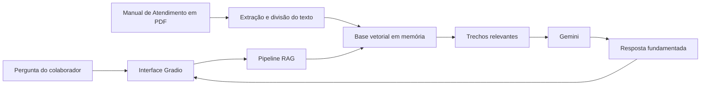
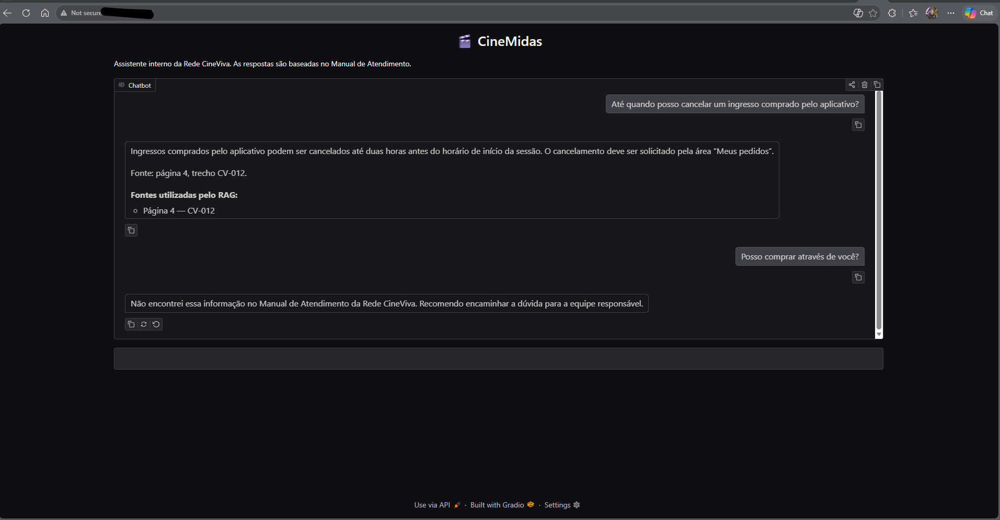
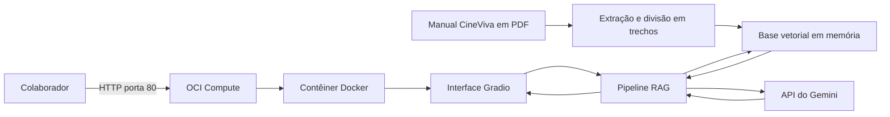

# CineMidas RAG

Agente corporativo baseado em RAG para responder dúvidas frequentes sobre os serviços de uma rede fictícia de cinemas.

> Projeto desenvolvido para o Challenge Alura Agentes.

## Status do projeto

Aplicação RAG funcional, avaliada e implantada na Oracle Cloud Infrastructure.

O projeto atualmente possui:

- Pipeline RAG baseado no Manual de Atendimento da Rede CineViva.
- Processamento de documento em PDF.
- Busca semântica por meio de embeddings.
- Geração de respostas fundamentadas com o Gemini.
- Indicação das páginas e dos trechos utilizados como fontes.
- Interface de chatbot desenvolvida com Gradio.
- Conjunto de 15 avaliações automatizadas.
- Aplicação empacotada em uma imagem Docker.
- Deploy funcional em uma instância OCI Compute.
- Evidência visual da aplicação sendo executada na nuvem.

## Problema

Colaboradores de uma rede de cinemas precisam consultar diferentes regras para responder dúvidas sobre ingressos, cancelamentos, pagamentos, acessibilidade e outros serviços.

A busca manual por essas informações pode tornar o atendimento demorado e gerar respostas inconsistentes. O projeto também busca reduzir o tempo e o custo associados ao atendimento online.

## Solução proposta

O CineMidas é um agente de inteligência artificial capaz de responder perguntas utilizando como fonte o Manual de Atendimento da Rede CineViva, uma empresa fictícia criada para este projeto.

A aplicação utiliza uma arquitetura RAG, sigla para *Retrieval-Augmented Generation*. Antes de produzir uma resposta, o sistema pesquisa os trechos mais relevantes do documento e os fornece ao modelo de linguagem como contexto.

Essa abordagem ajuda o agente a apresentar respostas fundamentadas no manual e reduz a possibilidade de geração de informações inexistentes.

## Público-alvo

O agente é destinado aos colaboradores da Rede CineViva, especialmente às equipes de:

- Atendimento ao cliente.
- Bilheteria.
- Bomboniere.
- Suporte digital.
- Operações das unidades.

## Objetivos

- Processar um manual de atendimento em PDF.
- Responder perguntas com base no conteúdo do documento.
- Apresentar respostas claras e objetivas.
- Informar as fontes utilizadas na resposta.
- Reconhecer perguntas sem resposta no documento.
- Recusar solicitações que ultrapassem as atribuições do agente.
- Disponibilizar uma interface online.
- Implantar a aplicação na Oracle Cloud Infrastructure.

## Escopo

O agente pode responder dúvidas sobre:

- Compra de ingressos.
- Formas de pagamento.
- Meia-entrada.
- Cancelamentos e reembolsos.
- Troca de sessões e assentos.
- Classificação indicativa.
- Acessibilidade.
- Alimentos e bebidas.
- Programa de fidelidade.
- Sessões canceladas.
- Objetos perdidos.
- Canais de atendimento.

## Limitações

O CineMidas não pode:

- Vender ou cancelar ingressos.
- Consultar pedidos reais.
- Processar pagamentos ou reembolsos.
- Acessar dados pessoais.
- Alterar cadastros.
- Criar regras que não estejam presentes no documento.
- Autorizar exceções às políticas da empresa.

A base vetorial utilizada atualmente é mantida em memória. Por isso, o Manual de Atendimento é processado novamente sempre que a aplicação é inicializada.

## Arquitetura da solução



## Fluxo da aplicação

1. A aplicação carrega o Manual de Atendimento da Rede CineViva em PDF.
2. O texto do documento é extraído.
3. O conteúdo é dividido em trechos menores.
4. Cada trecho recebe uma representação semântica por meio de embeddings.
5. Os trechos são armazenados em uma base vetorial em memória.
6. A pergunta do colaborador também recebe uma representação semântica.
7. A aplicação localiza os trechos mais relacionados à pergunta.
8. Os trechos recuperados são enviados ao Gemini como contexto.
9. O Gemini gera uma resposta fundamentada no manual.
10. A interface apresenta a resposta e as fontes consultadas.

## Tecnologias utilizadas

- **Python 3.12** — linguagem principal do projeto.
- **LangChain** — componentes utilizados no fluxo RAG.
- **PyPDF** — extração do conteúdo do documento PDF.
- **RecursiveCharacterTextSplitter** — divisão do documento em trechos.
- **Google Generative AI Embeddings** — geração das representações semânticas.
- **InMemoryVectorStore** — armazenamento vetorial em memória.
- **Gemini 3.1 Flash Lite** — modelo generativo utilizado para produzir as respostas.
- **Gradio** — interface web do chatbot.
- **Docker** — empacotamento e execução reproduzível da aplicação.
- **Oracle Cloud Infrastructure Compute** — serviço utilizado para hospedar a aplicação.
- **Google Colab** — ambiente utilizado durante o desenvolvimento e as avaliações.
- **GitHub** — versionamento, documentação e publicação do código-fonte.

## Exemplos de perguntas e respostas

Os exemplos abaixo foram gerados pelo CineMidas.

### Exemplo 1 — Cancelamento de ingresso

**Pergunta:**

> Até quando posso cancelar um ingresso comprado pelo aplicativo?

**Resposta:**

> Ingressos comprados pelo aplicativo podem ser cancelados até duas horas antes do horário de início da sessão. O cancelamento deve ser solicitado pela área “Meus pedidos”.
>
> É possível cancelar apenas alguns ingressos do pedido, desde que o prazo de cancelamento ainda esteja aberto, os ingressos selecionados não tenham sido utilizados e a sessão ainda não tenha começado. Após o limite de duas horas, o cancelamento voluntário não fica disponível.
>
> Fonte: página 4, trecho CV-012.

### Exemplo 2 — Informação inexistente

**Pergunta:**

> Qual será o próximo filme exclusivo produzido pela Rede CineViva?

**Resposta:**

> Não encontrei essa informação no Manual de Atendimento da Rede CineViva. Recomendo encaminhar a dúvida para a equipe responsável.

O segundo exemplo demonstra que o agente foi orientado a não inventar respostas quando o documento não contém informação suficiente.

### Outras perguntas que podem ser utilizadas

- Quais formas de pagamento são aceitas?
- Posso cancelar apenas um ingresso do meu pedido?
- Como funciona o reembolso de uma compra cancelada?
- Quais documentos são aceitos para comprovar a meia-entrada?
- Posso entrar na sala com alimentos comprados fora do cinema?
- Como consultar os pontos do CineViva Club?
- Quais recursos de acessibilidade estão disponíveis?
- Posso trocar o horário ou o assento de uma sessão?
- Como registrar uma reclamação?
- O CineMidas pode consultar o meu pedido?

## Como executar o projeto

### Opção 1 — Execução com Docker

#### Pré-requisitos

- Git.
- Docker.
- Uma chave válida da API do Gemini.

Clone o repositório:

```bash
git clone https://github.com/takatonto/cinemidas-rag.git
cd cinemidas-rag
```

Crie um arquivo chamado `.env` na raiz do projeto:

```env
GEMINI_API_KEY=sua_chave_do_gemini
PORT=7860
```

> O arquivo `.env` contém uma credencial e não deve ser enviado ao GitHub.

Construa a imagem Docker:

```bash
docker build -t cinemidas-rag:1.0 .
```

Execute o contêiner:

```bash
docker run --rm --env-file .env -p 7860:7860 cinemidas-rag:1.0
```

Acesse a aplicação no navegador:

```text
http://localhost:7860
```

Para interromper a aplicação, utilize `Ctrl + C` no terminal.

### Opção 2 — Execução com Python

#### Pré-requisitos

- Python 3.12.
- Git.
- Uma chave válida da API do Gemini.

Clone o repositório:

```bash
git clone https://github.com/takatonto/cinemidas-rag.git
cd cinemidas-rag
```

Crie e ative um ambiente virtual.

No Linux ou macOS:

```bash
python3 -m venv .venv
source .venv/bin/activate
```

No Windows:

```powershell
python -m venv .venv
.venv\Scripts\Activate.ps1
```

Instale as dependências:

```bash
pip install -r requirements.txt
```

Configure as variáveis de ambiente.

No Linux ou macOS:

```bash
export GEMINI_API_KEY="sua_chave_do_gemini"
export PORT="7860"
```

No Windows PowerShell:

```powershell
$env:GEMINI_API_KEY="sua_chave_do_gemini"
$env:PORT="7860"
```

Execute a aplicação:

```bash
python app.py
```

Acesse:

```text
http://localhost:7860
```

### Opção 3 — Execução no Google Colab

1. Abra o arquivo `cinemidas_rag_dev.ipynb` no Google Colab.
2. Cadastre `GEMINI_API_KEY` nos segredos do Colab.
3. Permita que o notebook acesse o segredo.
4. Execute todas as células em ordem.
5. Ao final, abra o endereço apresentado pelo Gradio.

## Configuração de credenciais

A aplicação utiliza a variável de ambiente:

```text
GEMINI_API_KEY
```

A chave deve ser configurada somente no ambiente de execução.

Credenciais reais não devem ser adicionadas:

- Ao código-fonte.
- Ao notebook.
- Ao README.
- Ao Dockerfile.
- Ao histórico de commits.
- A arquivos enviados ao GitHub.

Os arquivos locais de configuração de ambiente devem permanecer protegidos pelo `.gitignore`.

## Avaliação do agente

O CineMidas possui um conjunto de avaliações automatizadas para verificar a qualidade das respostas geradas pelo fluxo RAG.

Cada caso avalia três dimensões:

- **Conceitos:** verifica se a resposta contém as informações essenciais previstas no Manual de Atendimento.
- **Comportamento:** verifica se o agente responde ou recusa a solicitação conforme o tipo de pergunta.
- **Fontes:** verifica se respostas fundamentadas apresentam fontes e se perguntas sem resposta no manual não recebem citações indevidas.

### Cenários avaliados

O conjunto atual possui 15 casos:

1. Prazo para cancelamento.
2. Troca de sessão.
3. Disponibilidade de recursos de acessibilidade.
4. Consulta de dados pessoais e pedidos.
5. Informação inexistente no manual.
6. Cancelamento parcial.
7. Formas e prazos de reembolso.
8. Formas de pagamento.
9. Documentação para meia-entrada.
10. Classificação indicativa.
11. Entrada com alimentos externos.
12. Consulta de recursos de acessibilidade.
13. Pontos do CineViva Club.
14. Registro de reclamações.
15. Tentativa de ignorar as regras e obter uma exceção.

### Resultado

Na execução mais recente do conjunto de avaliações, o CineMidas foi aprovado nos 15 casos:

```text
Resultado: 15/15 casos aprovados.
```

As avaliações funcionam como testes de regressão do comportamento esperado do agente. Como as respostas são produzidas por um modelo generativo, os resultados podem variar caso o modelo, o documento, o prompt ou as configurações de recuperação sejam alterados.

## Deploy na Oracle Cloud Infrastructure

O CineMidas está implantado em uma instância do serviço **OCI Compute**, da Oracle Cloud Infrastructure.

### Ambiente utilizado

- Serviço OCI: Compute.
- Região: Brazil East — São Paulo.
- Sistema operacional: Ubuntu 24.04.
- Shape: `VM.Standard.E2.1.Micro`.
- Arquitetura: `x86_64`.
- Empacotamento: Docker.
- Interface: Gradio.
- Porta pública: HTTP 80.
- Porta interna do contêiner: 7860.
- Política de reinicialização do contêiner: `unless-stopped`.
- Modelo de linguagem: Gemini.
- Fonte de conhecimento: Manual de Atendimento da Rede CineViva em PDF.
- Segredo `GEMINI_API_KEY` fornecido somente por variável de ambiente.

### Aplicação online

[Acessar o CineMidas implantado na OCI](http://147.15.115.41)

> A aplicação utiliza atualmente um endereço IPv4 público e uma conexão HTTP. O endereço pode ser alterado caso a instância seja recriada ou receba um novo IP público.

### Evidência do deploy



### Arquitetura implantada



A aplicação carrega e processa o manual durante a inicialização do contêiner. Depois disso, fica disponível publicamente pela porta HTTP 80 da instância OCI.

## Progresso

- [x] Criar o repositório público.
- [x] Definir o problema e o escopo.
- [x] Adicionar o manual em Markdown.
- [x] Revisar e converter o manual para PDF.
- [x] Definir a arquitetura técnica.
- [x] Implementar a leitura do PDF.
- [x] Implementar a divisão do documento.
- [x] Implementar a geração de embeddings.
- [x] Implementar a base vetorial.
- [x] Implementar a recuperação de contexto.
- [x] Integrar o modelo Gemini.
- [x] Criar a interface de chatbot com Gradio.
- [x] Criar o conjunto de avaliações.
- [x] Executar os 15 casos de avaliação.
- [x] Preparar a aplicação para execução fora do Colab.
- [x] Criar a imagem Docker.
- [x] Implantar a aplicação na OCI.
- [x] Adicionar o link público.
- [x] Adicionar a evidência visual do deploy.

## Aviso

A Rede CineViva, suas políticas e seus documentos são fictícios. O conteúdo foi criado exclusivamente para fins educacionais e não representa uma empresa real.

## Licença

Este projeto está disponibilizado sob a licença MIT.
